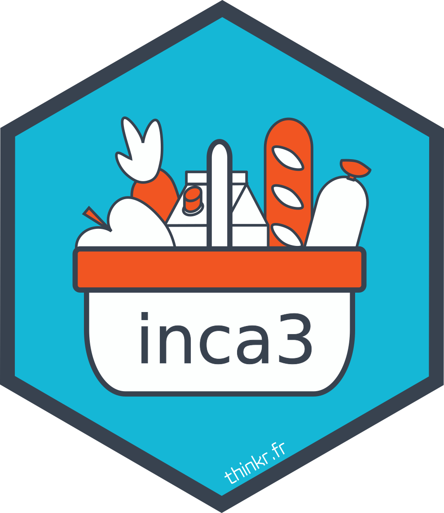

<!-- README.md is generated from README.Rmd. Please edit that file -->

# inca3 

<!-- badges: start -->

[](https://github.com/ThinkR-open/inca3/actions)
<!-- badges: end -->

Le package {inca3} est un package qui contient les jeux de données issus
de l’étude
[inca3](https://www.anses.fr/fr/content/etude-inca-3-pr%C3%A9sentation)
de l’[ANSES](https://www.anses.fr).

Il a pour objectif de faciliter l’utilisation de ces données pour le
logiciel R.

## Présentation des données

> Les études INCA permettent de situer l’alimentation de la population
> au regard des recommandations du Programme National Nutrition Santé
> (PNNS) et d’envisager de poursuivre, modifier ou renforcer les
> priorités de la politique nutritionnelle en France.

#### INCA 3 en chiffres

##### Qui ?

  - 4 000 participants, âgés de 0 à 79 ans, dont
      - 2 000 enfants et adolescents de 0 à 17 ans
      - 2 000 adultes de 18 à 79 ans

##### Où ?

  - 472 communes participent à l’étude, réparties sur l’ensemble du
    territoire métropolitain.

##### Comment ?

  - 3 jours de recueil de consommation répartis sur 3 semaines (week-end
    compris) : tous les aliments et boissons consommés sur ces 3 jours,
    décrits et quantifiés
  - Des questionnaires complémentaires pour mieux connaître vos
    habitudes : activité physique, compléments alimentaires,
    conservation des aliments et préparation des repas…

<!-- description: end -->

## Installation du package

<!-- install: start -->

Pour installer le package :

``` r
# install.packages("remotes")
remotes::install_github("thinkr-open/inca3", build_vignettes = FALSE)
```

<!-- install: end -->

## Réferences

Carine Dubuisson, Ariane Dufour, Sandrine Carrillo, Peggy
Drouillet-Pinard, Sabrina Havard, Jean-Luc Volatier (2019). The Third
French Individual and National Food Consumption (INCA3) Survey
2014-2015: method, design and participation rate in the framework of a
European harmonization process. Public Health Nutrition: 22(4), 584–600.
[doi:10.1017/S1368980018002896](https://doi.org/10.1017/S1368980018002896).
